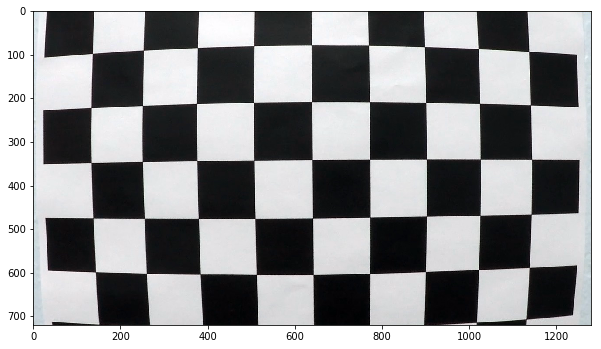
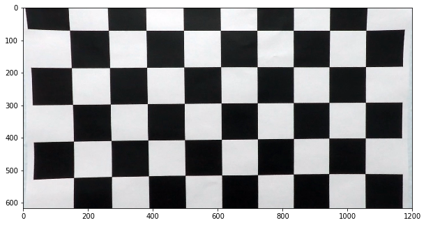
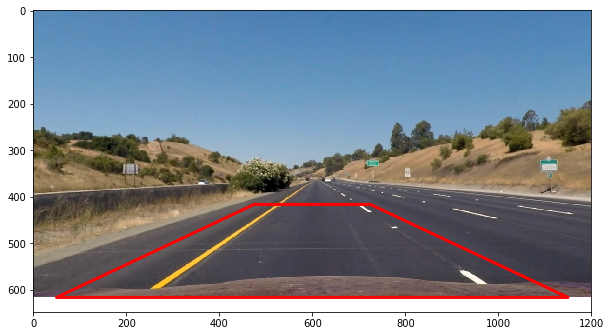
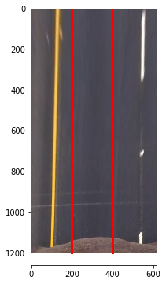
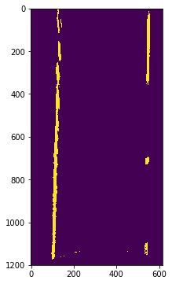
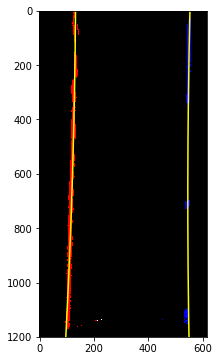
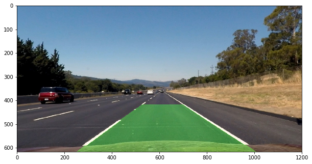
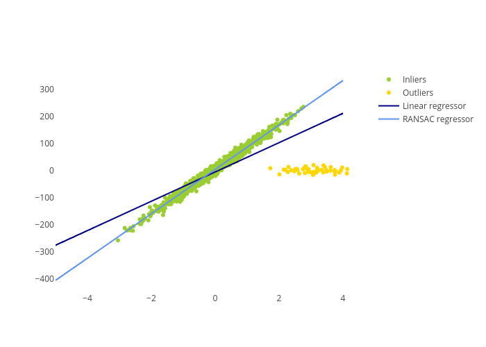

# Advanced Lane detection - Udacity CarND P4

## Camera calibration

To get camera distortion matrix we have to calibrate camera using chessboard images and OpenCV's functions findChessboardCorners() and calibrateCamera(). Two resulting variables: mtx, dist can be used to apply to any new image using OpenCV's functions getOptimalNewCameraMatrix() and undistort(). Example resulting undistorted chessboard image:

#### Before undistortion



#### After undistortion



## Perspective transformations

Lane curvature can be calculated after the required perspective transformation is applied. My function for this transformation is called warp_perspective() and defined below the "Warp perspective" block of the notebook. The source polygon I define like this:

```
self.polygon = np.array([x_center - 125, self.h - 200,
                 x_center + 125, self.h - 200,
                 x_center - 550, self.h,
                 x_center + 550, self.h], dtype = "float32").reshape(4, 2)
```

As a demonstration, here it's added on top of the road.



Perspective transformation on the given road image with polygon produces following image:



Here on the picture, white and yellow lines are not parallel to red lines, but are parallel to each other. That proves that region of interest for perspective wrapping had been choosen correctly.

### Threshold binary image

In order to detect lane curvature more precisely we must reduce irrelevant image pixels. We do so by applying Sobel gradient on the x-asis with default kernel size to the L-channel. Then we apply thresholds sx_thresh=(20, 100) (see function pipeline() below "Threshold binary image" paragraph of the notebook). We also apply thresholds s_thresh=(170, 255) to the S-channel of the image. Resulting image after both thresholding results image can be seen here:



### Fit with polynomial

Lane pixels selected on the previous step can be used to apply a polynomial fit of the 2nd order. We assume that there're two parallel lanes on the picture: left and right. We calculate histogram of the point distribution and find the center position of both lanes. Using the rolling window technique we separate pixels belonging to both lanes and apply Numpy's polyfit() method to get the coefficients of the polynomial. Fitted polynomial drawn with yellow on the following image:



Pixels of the left lane are red and blue is for right lane. However the example image is not much interesting since the fitted polynomials are just vertical lines in this case.

### Calculate curvead

Curvead of the lanes can be calculated using coefficients of the polynomial and formulas given in the lectures. The following coefficients also applied in order to convert pixels to meters of the radius (see function calc_curverad() under "Calculate curvead" paragraph):

```
ym_per_pix = 30 / 720 # meters per pixel in y dimension
xm_per_pix = 3.7 / 700 # meters per pixel in x dimension
```

### Draw detected lanes

Now we can apply all methods described above to visualize detected lanes on the project video. We do that by drawing polynomials, applying reverse warp transformation and add on top of the video frame as a semi-transparent layer. Here how it looks like:



### Video demonstration

Here, the visualization of the lanes detection performed using project_video.mp4:

https://youtu.be/7Qu0B_IvBd4

### Discussion

The following additional techniques besides the discussed in the lecture material were applied to pipeline to complete the project:

* A sanity check was added. Extreme fits are detected using OpenCV's matchShapes() function. Irrelevant fits are dropped and the fit stored from previous frames is used.
* I was forced to cut off the hood image with mask from the bottom of the camera image. Especially during Sobel transformation step this image introduces some pixel noise that influenced the line finding algorithm much.
* White and Yellow line color detection added. It wasn't enough to extract HSV or HLS value channel features and detect x/y Sobel gradients and the fine tuning of it's thresholds soon became unreliable. Thus, if we assume that lane borders can be painted with only white and yellow colors and the color of the road can't be light (which is of course not always true especially during sunny days).
* Polyfit weights introduced to reduce noisy influence points. The road surface cannot be smooth in reality. My line detection algorithm extracted some noisy pixels introduced mostly during the perspective transformation step. The more bigger the distance of pixel from camera, the more grainy and noisy becames the result of perspective transformation. Again, this introduced some unwanted noisy influence points into the fit. My idea was to reduce the influence of the remote pixels and increase the influence of the features that are closer to the car. Here, weight of each pixel in np.polyfit formula is proportional to 1/y, where y is the distance from the bottom of the image in pixels.

As said above, my lane detection algorithm is very influenced by the noise that come from feature detector filters. Especially in the fit phase. What can be easily done is to replace the simple polyfit() algorithm with some more robust analogues, like, for example, RANSAC. Here, the picture roughly demonstrates it's ability to ignore outlier points (leverage points):



The other simple technique that can improve lane detection is to hardcode some real life rules and expectations such that the distance between lines cannot be more than 3 meters and less than 2.5 meters, for example. Thus, a lane detection algorithm can expect where the line can appear on the next frame most probably, giving more weight to expected features and less to some unexpected or noisy features. Shortly speaking, some knowledge about car positioning and direction of movement could improve the detection robustness.  
